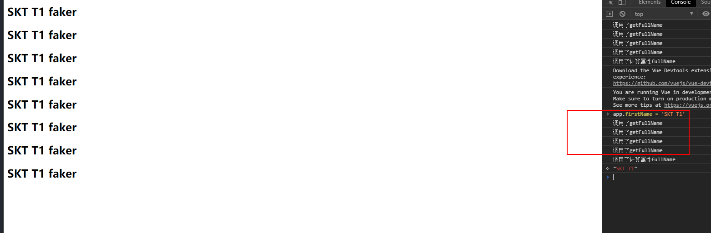

# （五）计算属性

## 5.1	计算属性的基本使用

​	现在有变量姓氏和名字，要得到完整的名字。

```html
<!DOCTYPE html>
<html lang="en">
<head>
  <meta charset="UTF-8">
  <meta name="viewport" content="width=device-width, initial-scale=1.0">
  <meta http-equiv="X-UA-Compatible" content="ie=edge">
  <title>计算属性的基本使用</title>
</head>
<body>
  <div id="app">
    <!-- Mastache语法 -->
    <h2>{{firstName+ " " + lastName}}</h2>
    <!-- 方法 -->
    <h2>{{getFullName()}}</h2>
    <!-- 计算属性 -->
    <h2>{{fullName}}</h2>
  </div>
  <script src="https://cdn.jsdelivr.net/npm/vue@2.6.10/dist/vue.js"></script>
  <script>
    const app = new Vue({
      el:"#app",
      data:{
        firstName:"skt t1",
        lastName:"faker"
      },
      computed: {
        fullName:function(){
          return this.firstName + " " + this.lastName
        }
      },
      methods: {
        getFullName(){
          return this.firstName + " " + this.lastName
        }
      },
    })
  </script>
</body>
</html>
```

1. 使用Mastache语法拼接`<h2>{{firstName+ " " + lastName}}</h2>`
2. 使用方法methods`<h2>{{getFullName()}}</h2>`
3. 使用计算属性computed`<h2>{{fullName}}</h2>`


> ​	例子中计算属性computed看起来和方法似乎一样，只是方法调用需要使用()，而计算属性不用，方法取名字一般是动词见名知义，而计算属性是属性是名词，但这只是基本使用。

## 5.2	计算属性的复杂使用

​	现在有一个数组数据books，里面包含许多book对象，数据结构如下：

```javascript
books:[
          {id:110,name:"JavaScript从入门到入土",price:119}, 
          {id:111,name:"Java从入门到放弃",price:80},
          {id:112,name:"编码艺术",price:99},
          {id:113,name:"代码大全",price:150},
        ]
```

​	要求计算出所有book的总价格`totalPrice`。

​	

```html
<!DOCTYPE html>
<html lang="en">
<head>
  <meta charset="UTF-8">
  <meta name="viewport" content="width=device-width, initial-scale=1.0">
  <meta http-equiv="X-UA-Compatible" content="ie=edge">
  <title>计算属性的复杂使用</title>
</head>
<body>
  <div id="app">


    <h2>总价格：{{totalPrice}}</h2>

  </div>
  <script src="https://cdn.jsdelivr.net/npm/vue@2.6.10/dist/vue.js"></script>
  <script>
    const app = new Vue({
      el:"#app",
      data:{
        books:[
          {id:110,name:"JavaScript从入门到入土",price:119},
          {id:111,name:"Java从入门到放弃",price:80},
          {id:112,name:"编码艺术",price:99},
          {id:113,name:"代码大全",price:150},
        ]
      },
      computed: {
        totalPrice(){
          let result= 0;
          for (let i = 0; i < this.books.length; i++) {
            result += this.books[i].price;
          }
          return result
        }
      }
    })
  </script>
</body>
</html>
```

​	获取每一个book对象的price累加，当其中一个book的价格发生改变时候，总价会随之变化。

## 5.3	计算属性的setter和getter

​	在计算属性中其实是由这样两个方法setter和getter。

```javascript
      computed: {
        fullName:{
          //计算属性一般没有set方法，只读属性
          set:function(newValue){
            console.log("-----")
            const names = newValue.split(" ")
            this.firstName = names[0]
            this.lastName = names[1]
          },
          get:function(){
            return this.firstName + " " + this.lastName
          }
        }
      }
```

​	但是计算属性一般没有set方法，只读属性，只有get方法，但是上述中newValue就是新的值，也可以使用set方法设置值，但是一般不用。

## 5.4	计算属性和methods的对比

​	直接看代码，分别使用计算属性和方法获得fullName的值。

```html
<!DOCTYPE html>
<html lang="en">
<head>
  <meta charset="UTF-8">
  <meta name="viewport" content="width=device-width, initial-scale=1.0">
  <meta http-equiv="X-UA-Compatible" content="ie=edge">
  <title>计算属性和methods的对比</title>
</head>
<body>
  <div id="app">
    <!-- methods，即使firstName和lastName没有改变，也需要再次执行 -->
    <h2>{{getFullName}}</h2>
    <h2>{{getFullName}}</h2>
    <h2>{{getFullName}}</h2>
    <h2>{{getFullName}}</h2>
    <!-- 计算属性有缓存，只有关联属性改变才会再次计算 -->
    <h2>{{fullName}}</h2>
    <h2>{{fullName}}</h2>
    <h2>{{fullName}}</h2>
    <h2>{{fullName}}</h2>


  </div>
  <script src="https://cdn.jsdelivr.net/npm/vue@2.6.10/dist/vue.js"></script>
  <script>
    const app = new Vue({
      el:"#app",
      data:{
        firstName:"skt t1",
        lastName:"faker"
      },
      computed: {
        fullName(){
          console.log("调用了计算属性fullName");

          return this.firstName + " " + this.lastName
        }
      },
      methods: {
        getFullName(){
          console.log("调用了getFullName");

          return this.firstName + " " + this.lastName
        }
      },
    })
  </script>
</body>
</html>
```

​	分别使用方法和计算属性获取四次fullName，结果如图。


​	由此可见计算属性有缓存，在`this.firstName + " " + this.lastName`的属性不变的情况下，methods调用了四次，而计算属性才调用了一次，性能上计算属性明显比methods好。而且在改动firstName的情况下，计算属性只调用一次，methods依然要调用4次。



