# （十五）webpack

## 15.1	webpack起步

### 15.1.1	什么是webpack

webpack是一个JavaScript应用的静态模块打包工具。


从这句话中有两个要点，**模块**和**打包**需要关注。**grunt/gulp**都可以打包，那有什么区别。

> 模块化

webpack可以支持前端模块化的一些方案，例如AMD、CMD、CommonJS、ES6。可以处理模块之间的依赖关系。不仅仅是js文件可以模块化，图片、css、json文件等等都可以模块化。

> 打包

webpack可以将模块资源打包成一个或者多个包，并且在打包过程中可以处理资源，例如压缩图片，将scss转成css，ES6语法转成ES5语法，将TypeScript转成JavaScript等等操作。**grunt/gulp**也可以打包。

**和grunt/glup的对比**

- grunt/glup的核心是Task
  - 我们可以配置一系列的task，并且定义task要处理的事务（例如ES6/TS转化，图片压缩，scss转css）
  - 之后可以让grunt/glup来执行依次这些任务，让整个流程自动化
  - 所以grunt/glup也被称为前端自动化任务管理工具
- 看一个gulp例子
  - task将src下的js文件转化为ES5语法
  - 并输入到dist文件夹中

<pre>const gulp = require('gulp')
    const babel = require('gulp-babel')
    gulp.task('js'()=>
      gulp.src('src/*.js')
        .pipe(babel({
          presets:['es2015']
        }))
        .pipe(gulp.dest('dist'))
    );
</pre>

- 什么时候使用grunt/gulp呢？
  - 如果工程依赖简单，甚至没有模块化
  - 只需要进行简单的合并/压缩
  - 如果模块复杂，相互依赖性强，我们需要使用webpack
- grunt/glup和webpack区别
  - grunt/glup更加强调的是前端自动化流程，模块化不是其核心
  - webpack加强模块化开发管理，而文件压缩/合并/预处理等功能，是附带功能

webpack就是前端模块化打包工具

### 15.1.2	webpack的安装

1. webpack依赖node环境。
2. node环境依赖众多包，所以需要npm，npm（node packages manager）node包管理工具
3. nvm是node管理工具可以自由切换node环境版本

**全局安装webpack**

```shell
npm install webpack -g
//指定版本安装
npm install webpack@3.6.0 -g
```

> 由于vue-cli2基于webpack3.6.0
> 如果要用vue-cli2的可以使用`npm install webpack@3.6.0 -g`

**局部安装**

```shell
npm install webpack --save-dev
```

- 在终端执行webpack命令，使用的是全局安装。

- 当在package.json中定义了scripts时，其中包括了webpack命令，那么使用的是局部webpack

### 15.1.3    起步

新建一个文件夹，新建如下结构的目录：

**目录结构**

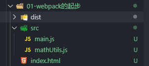

如图所示在src文件夹（源码文件夹），dist（要发布的文件，已经处理过的）。

**1.新建入口js文件`main.js`和`mathUtils.js`，`main.js`依赖`mathUtils.js`。**

> mathUtils

```javascript
//1.新建mathUtils.js，用CommonJs规范导出
function add(num1,num2) {
  return num1+num2
}
function mul(num1,num2) {
  return num1*num2
}
module.exports = {
  add,mul
}
```

> main.js

```javascript
//2.新建入口js文件main.js 导入mathUtil.js文件，并调用
const {add,mul} = require("./mathUtils.js")

console.log(add(10,20))
console.log(mul(10,10))
```

**2.使用webpack命令打包js文件**

> 注意：webpack3使用`webpack ./src/main.js ./dist/bundle.js`
>
> webpack4，webpack打包在01-webpack的起步目录下打开终端 `webpack ./scr/main.js -o ./dist/bundle.js`

我全局安装的是webpack@3.6.0，所以在根路径执行

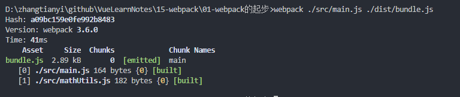

如图显示打包成功，查看dist文件夹下自动生成了一个`bundle.js`。

> bundle.js

```javascript
//2.新建入口js文件main.js 导入mathUtil.js文件，并调用
const {add,mul} = __webpack_require__(1)

console.log(add(10,20))
console.log(mul(10,10))

/***/ }),
/* 1 */
/***/ (function(module, exports) {

//1.新建mathUtils.js，用CommonJs规范导出
function add(num1,num2) {
  return num1+num2
}
function mul(num1,num2) {
  return num1*num2
}
module.exports = {
  add,mul
}

```

内容很多，其中包含mathUtils.js和main.js 内容，打包成功。

**3.新建一个index.html文件，导入bundle.js**

```html
<!DOCTYPE html>
<html lang="en">
<head>
  <meta charset="UTF-8">
  <meta name="viewport" content="width=device-width, initial-scale=1.0">
  <meta http-equiv="X-UA-Compatible" content="ie=edge">
  <title>webpack入门</title>
</head>
<body>
  <!-- 3.新建一个indexhtml文件并使用 webpack ./src/main.js ./dist/bundle.js webpack3使用此命令 -->
  <!-- 4.引用webpack打包后的js文件 -->
  <script src="./dist/bundle.js"></script>
</body>
</html>
```

如图测试，打印成功。

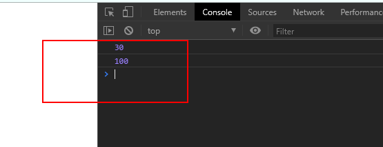

**4.新建一个`info.js`使用ES6的语法导出**

> info.js

```javascript
//es6语法导出
export default {
  name:'zzz',
  age:24,
}
```

> main.js导入info.js

```javascript
//使用es6语法导入
import info from './info.js'

console.log(info.name)
console.log(info.age)
```

> 再次使用`webpack ./src/main.js ./dist/bundle.js`，重新打包

**5.打开index.html测试**

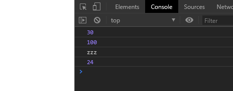

> 总结

webpack可以帮我们打包js文件，只要指定入口文件（main.js）和输出的文件（bundle.js），不管是es6的模块化还是CommonJs的模块化，webpack都可以帮我们打包，还可以帮我们处理模块之间的依赖。

## 15.2	webpack的配置

### 15.2.1	基本配置

如果每次都用webpack命令自己写入口文件和出口文件会很麻烦，此时我们可以使用webpack的配置。

> 准备工作：复制**01-webpack的起步**文件夹并粘贴在同级目录，改名为**02-webpack的配置**。

**1.在根目录（02-webpack的配置）下新建一个`webpack.config.js`**

> webpack.config.js

```javascript
//1.导入node的path包获取绝对路径，需要使用npm init初始化node包
const path = require('path')

//2.配置webpack的入口和出口
module.exports = {
  entry: './src/main.js',//入口文件
  output:{
    path: path.resolve(__dirname, 'dist'),//动态获取打包后的文件路径,path.resolve拼接路径
    filename: 'bundle.js'//打包后的文件名
  }
}
```

**2.在02-webpack的配置根目录执行`npm init`初始化node包，因为配置文件中用到了node的path包**

```shell
npm init 
```

初始化

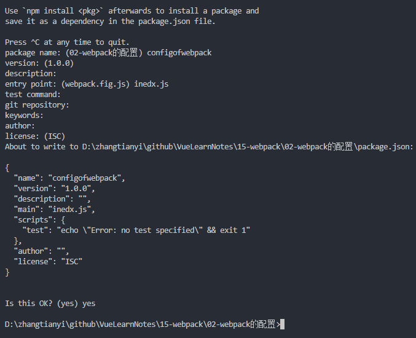

**3.使用webpack打包**

```shell
webkpack
```

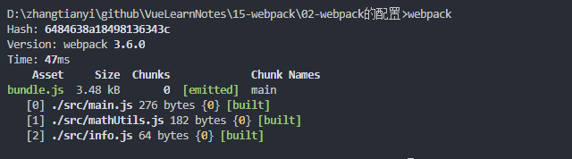

这样入口和出口的配置已经配置完成了，只需要使用webpack命令就行了。

4.使用自定义脚本（script）启动

一般来是我们使用的是

```shell
npm run dev//开发环境
npm run build//生产环境
```

在package.json中的script中加上

```json
"build": "webpack"
```

使用`npm run build`

```shell
npm run build
```

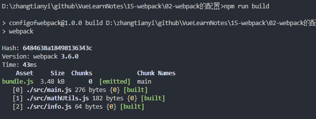

### 15.2.2	全局安装和局部安装

webpack有全局安装和局部安装。

> 局部安装

**使用`npm run build`执行webpack会先从本地查找是否有webpack，如果没有会使用全局的。**

此时本地需要安装webapck

```shell
npm install webpack@3.6.0 --save-dev
```

package.json中自动加上开发时的依赖`devDependencies`

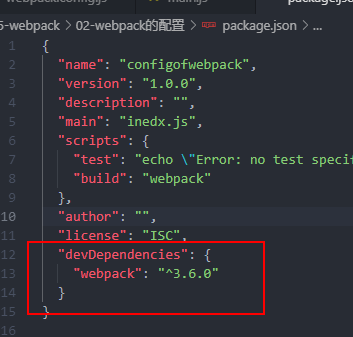

再次使用`npm run build`，使用的是本地webpack版本。

## 15.3	webpack的loader

### 15.3.1	什么是loader

loader是webpack中一个非常核心的概念。

webpack可以将js、图片、css处理打包，但是对于webpack本身是不能处理css、图片、ES6转ES5等。

此时就需要webpack的扩展，使用对应的loader就可以。

**loader使用**

> 步骤一：通过npm安装需要使用的loader

> 步骤二：通过webpack.config.js中的modules关键字下进行配置

大部分loader可以在webpack的官网找到对应的配置。

### 15.3.2	CSS文件处理	

> 准备工作：复制02-webpack的配置到根目录，改名字为03-webpack的loader

**1.将除了入口文件（main.js）所有js文件放在js文件夹，新建一个css文件夹，新建一个normal.css文件**

> normal.css

```css
body{
  background-color: red;
}
```

**2.main.js导入依赖**

```javascript
//4.依赖css文件
require('./css/normal.css')
```

此时如果直接进行打包`npm run build`。

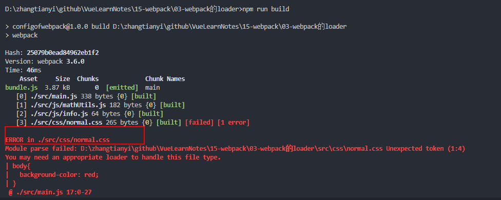

> 提示信息很清楚，打包到css文件时报错，提示我们可能需要一个loader来处理css文件。

**3.安装css-loader**

```shell
npm install --save-dev css-loader
```

**4.使用css-loader**

```javascript
module.exports = {
  module: {
    rules: [
      {
        test: /\.css$/,//正则表达式匹配css文件
        //css-loader只负责css文件加载，不负责解析，要解析需要使用style-loader
        use: [{
          loader: 'css-loader'
        }]//使用loader
      }
    ]
  }
}
```

> 执行`npm run build`，提示打包成功，但是背景色并没有变红色，是因为css-loader只负责加载css文件，不负责解析，如果要将样式解析到dom元素中需要使用style-loader。

5.安装使用style-loader

```shell
npm install --save-dev style-loader
```

```javascript
  module: {
    rules: [
      {
        test: /\.css$/,//正则表达式匹配css文件
        //css-loader只负责css文件加载，不负责解析，要解析需要使用style-loader
        use: [{
          loader: 'style-loader'
        }, {
          loader: 'css-loader'
        }]//使用loader
      }
    ]
  }
```

> webpack使用多个loader是从右往左解析的，所以需要将css-loader放在style-loader右边，先加载后解析。

此时样式成加载解析到DOM元素上。

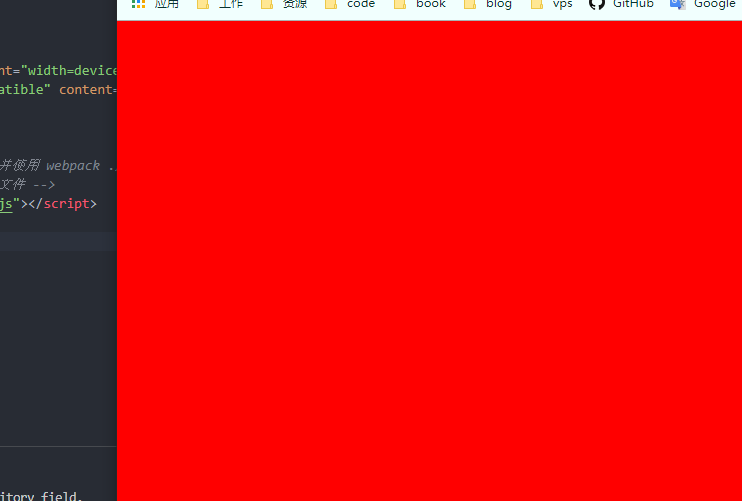

### 15.3.3	less文件处理

**1.在css文件夹中新增一个less文件**

> special.less

```less
@fontSize:50px;//定义变量字体大小
@fontColor:orange;//定义变量字体颜色
body{
  font-size: @fontSize;
  color: @fontColor;
}
```

**2.main.js中导入less文件模块**

```javascript
//5.依赖less文件
require('./css/special.less')
//6.向页面写入一些内容
document.writeln("hello,zzzz!")
```

**3.安装使用less-loader**

```shell
npm install --save-dev less-loader less
```

在`webpack.config.js`中使用less-loader

```javascript
  module: {
    rules: [
      {
        test: /\.less$/,//正则表达式匹配css文件
        //css-loader只负责css文件加载，不负责解析，要解析需要使用style-loader
        use: [{
          loader: 'style-loader'
        }, {
          loader: 'css-loader'
        }, {
          loader: 'less-loader'//less文件loader
        }]//使用loader
      }
    ]
  }
```

**4.执行npm run build**

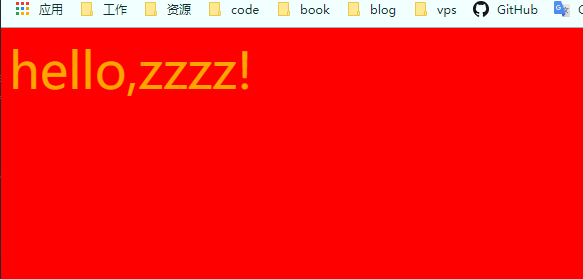

less文件生效了，字体是orange，大小为50px。

### 15.3.4	图片文件的处理

> 准备工作，准备两张图片，图片大小为一张8KB以下（实际大小为5KB，名称为small.jpg），一张大于8KB（实际大小为10KB，名称为big.jpg），新建一个img文件夹将两张图片放入。

**1.修改normal.css样式，先使用小图片作为背景**

```
body{
  /* background-color: red; */
  background: url("../img/small.jpg");
}
```

此时如果直接使用npm run build 直接打包会报错，因为css文件中引用了图片url，此时需要使用**url-loader**。

**2.安装使用url-loader处理图片**

  url-loader像 file loader 一样工作，但如果文件小于限制，可以返回 [data URL](https://tools.ietf.org/html/rfc2397) 。

```shell
npm install --save-dev url-loader
```

配置

```javascript
{
        test: /\.(png|jpg|gif)$/,//匹配png/jpg/gif格式图片
        use: [
          {
            loader: 'url-loader',
            options: {
              limit: 8192//图片小于8KB时候将图片转成base64字符串，大于8KB需要使用file-loader
            }
          }
        ]
      }
```

**3.打包**

使用npm run build打包后，打开index.html。

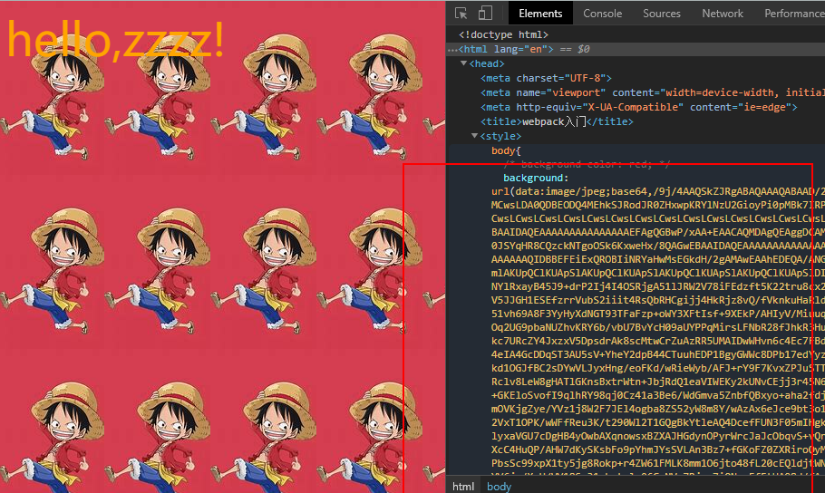

> 小于`limit`大小的图片地址被编译成base64格式的字符串。

此时修改css文件，使用big.jpg做背景。

```css
body{
  /* background-color: red; */
  /* background: url("../img/small.jpg"); */
  background: url("../img/big.jpg");
}
```

再次打包，报错，提示未找到file-loader模块。

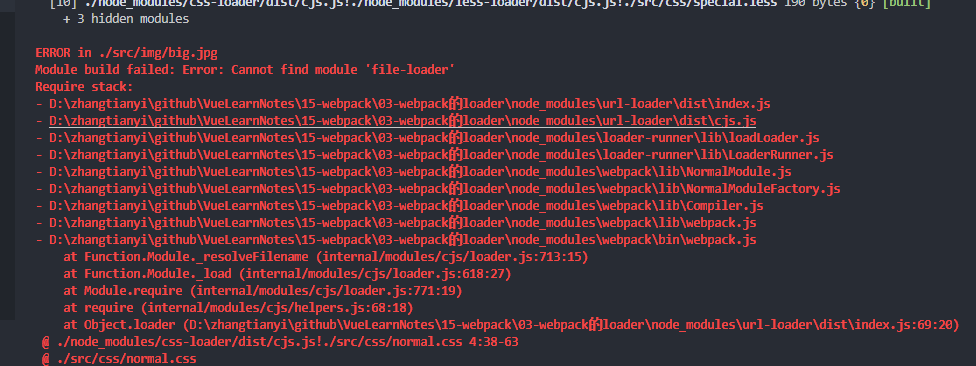

> 因为大于`limit`的图片需要`file-loader`来打包。

**4.安装使用file-loader处理图片**

```shell
npm install --save-dev file-loader
```

不需要配置，因为url-loader超过limit的图片会直接使用file-loader。

再次打包，没有报错，打包成功，但是图片未显示。

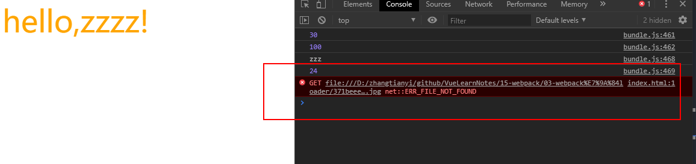

> 1.当加载的图片大小小于limit，使用base64将图片编译成字符串
>
> 2.当加载的图片大小大于limit，使用file-loader模块直接将big.jpg直接打包到dist文件家，文件名会使用hash值防止重复。
>
> 3.此时由于文件路径不对所以导致没有加载到图片

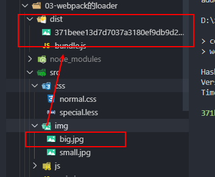

**5.如何使用file-loader，指定路径**

修改output属性

```javascript
  output:{
    path: path.resolve(__dirname, 'dist'),//动态获取打包后的文件路径,path.resolve拼接路径
    filename: 'bundle.js',//打包后的文件名
    publicPath: 'dist/'
  },
```

此时打包，图片正常显示

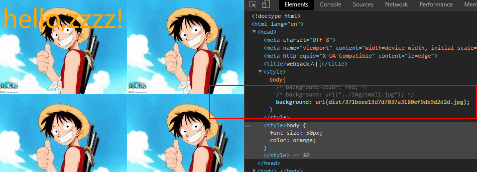


> 注意：一般来说，index.html最终也会打包到dist文件夹下，所以，并不需要配置publicPath，如何打包index.html请看webpack处理.vue文件。

> file-loader打包后，使用hash值做文件名太长，此时可以使用options的一些配置。

```javascript
options: {
              limit: 8192,//图片小于8KB时候将图片转成base64字符串，大于8KB需要使用file-loader
              name: 'img/[name].[hash:8].[ext]'//img表示文件父目录，[name]表示文件名,[hash:8]表示将hash截取8位[ext]表示后缀
            }
```

> 修改options，加上name属性，其中img表示文件父目录，[name]表示文件名,[hash:8]表示将hash截取8位[ext]表示后缀

再次打包

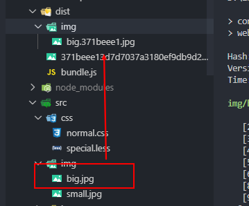

### 15.3.5	ES6语法处理

webpack打包时候ES6语法没有打包成ES5语法，如果需要将ES6打包成ES5语法，那么就需要使用babel。直接使用babel对应的loader就可以了。

安装

```shell
npm install --save-dev babel-loader@7 babel-core babel-preset-es2015
```

配置

```javascript
      {
        test: /\.js$/,
        //排除node模块的js和bower的js
        exclude: /(node_modules|bower_components)/,
        use: {
          loader: 'babel-loader',
          options: {
            //如果要使用@babel/preset-env这里需要在根目录新建一个babel的文件
            // presets: ['@babel/preset-env']
            //这里直接使用指定
            presets: ['es2015']
          }
        }
      }
```

> 1.如果要使用@babel/preset-env这里需要在根目录新建一个babel的文件
>
> 2.exclude排除不需要打包的文件