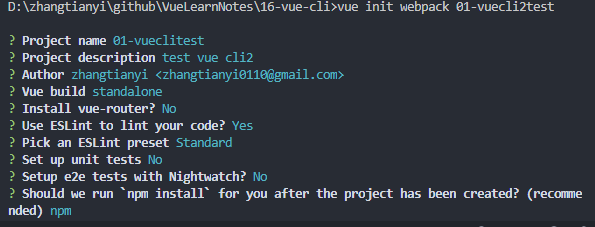
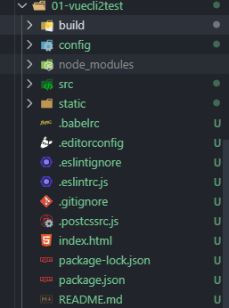
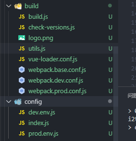
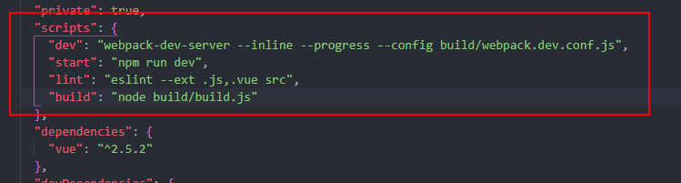
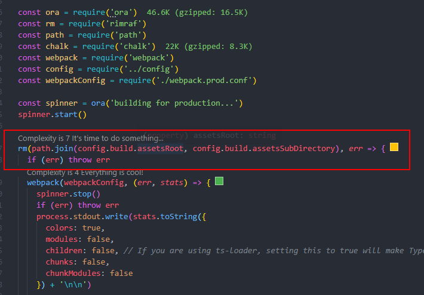
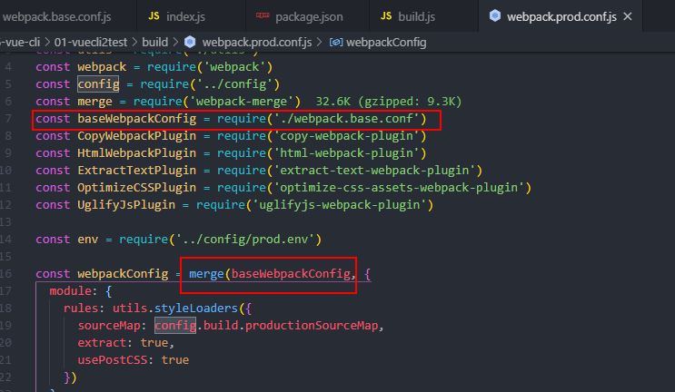

# （十六）vue-cli

## 16.1	vue-cli起步

### 16.1.1	什么是vue-cli

Vue CLI 是一个基于 Vue.js 进行快速开发的完整系统，提供：

- 通过 `@vue/cli` 搭建交互式的项目脚手架。
- 通过 `@vue/cli` + `@vue/cli-service-global` 快速开始零配置原型开发。
- 一个运行时依赖 (`@vue/cli-service`)，该依赖：
  - 可升级；
  - 基于 webpack 构建，并带有合理的默认配置；
  - 可以通过项目内的配置文件进行配置；
  - 可以通过插件进行扩展。
- 一个丰富的官方插件集合，集成了前端生态中最好的工具。
- 一套完全图形化的创建和管理 Vue.js 项目的用户界面。

Vue CLI 致力于将 Vue 生态中的工具基础标准化。它确保了各种构建工具能够基于智能的默认配置即可平稳衔接，这样你可以专注在撰写应用上，而不必花好几天去纠结配置的问题。与此同时，它也为每个工具提供了调整配置的灵活性，无需 eject。

### 16.1.2	**CLI是什么意思？**

- CLI是Command-Line Interface，即命令行界面，也叫脚手架。
- vue cli 是vue.js官方发布的一个vue.js项目的脚手架
- 使用vue-cli可以快速搭建vue开发环境和对应的webpack配置


### 16.1.3	vue cli使用

**vue cli使用前提node**

vue cli依赖nodejs环境，vue cli就是使用了webpack的模板。

安装vue脚手架，现在脚手架版本是vue cli3

```shell
npm install -g @vue/cli
```

如果使用yarn

```bash
yarn global add @vue/cli
```

安装完成后使用命令查看版本是否正确：

```bash
vue --version
```

> 注意安装cli失败

1. 以管理员使用cmd
2. 清空npm-cache缓存

```bash
npm clean cache -force
```

**拉取2.x模板（旧版本）**

 Vue CLI >= 3 和旧版使用了相同的 `vue` 命令，所以 Vue CLI 2 (`vue-cli`) 被覆盖了。如果你仍然需要使用旧版本的 `vue init` 功能，你可以全局安装一个桥接工具： 

```bash
npm install -g @vue/cli-init
# `vue init` 的运行效果将会跟 `vue-cli@2.x` 相同
vue init webpack my-project
```

**1.在根目录新建一个文件夹`16-vue-cli`，cd到此目录，新建一个vue-cli2的工程。**

```bash
cd 16-vue-cli
//全局安装桥接工具
npm install -g @vue/cli-init
//新建一个vue-cli2项目
vue init webpack 01-vuecli2test
```

> 注意：如果是创建vue-cli3的项目使用：

```bash
vue create 02-vuecli3test
```

2.创建工程选项含义



- project name：项目名字（默认）
- project description：项目描述
- author：作者（会默认拉去git的配置）
- vue build：vue构建时候使用的模式
  - runtime+compiler：大多数人使用的，可以编译template模板
  - runtime-only：比compiler模式要少6kb，并且效率更高，直接使用render函数
- install vue-router：是否安装vue路由
- user eslint to lint your code：是否使用ES规范
- set up unit tests：是否使用unit测试
- setup e2e tests with nightwatch：是否使用end 2 end，点到点自动化测试
- Should we run `npm install` for you after the project has been created? (recommended)：使用npm还是yarn管理工具

等待创建工程成功。

> 注意：如果创建工程时候选择了使用ESLint规范，又不想使用了，需要在config文件夹下的index.js文件中找到useEslint，并改成false。

```javascript
    // Use Eslint Loader?
    // If true, your code will be linted during bundling and
    // linting errors and warnings will be shown in the console.
    useEslint: true,
```

## 16.2	vue-cli的目录结构

创建完成后，目录如图所示：



其中build和config都是配置相关的文件。

### 16.2.1	build和config



如图所示，build中将webpack的配置文件做了分离：

- `webpack.base.conf.js`（公共配置）
- `webpack.dev.conf.js`（开发环境）
- `webpack.prod.conf.js`（生产环境）

我们使用的脚本命令配置在`package.json`中。



打包构建：

```bash
npm run build
```

如果搭建了本地服务器`webpack-dev-server`，本地开发环境：

```bash
npm run dev
```

此时`npm run build`打包命令相当于使用node 执行build文件夹下面的build.js文件。

> build.js



1. 检查dist文件夹是否已经存在，存在先删除
2. 如果没有err，就使用webpack的配置打包dist文件夹

在生产环境，即使用build打包时候，使用的是`webpack.prod.conf.js`配置文件。



源码中，显然使用了`webpack-merge`插件来合并prod配置文件和公共的配置文件，合并成一个配置文件并打包，而`webpack.dev.conf.js`也是如此操作，在开发环境使用的是dev的配置文件。

config文件夹中是build的配置文件中所需的一些变量、对象，在`webpack.base.conf.js`中引入了`index.js`。

```javascript
const config = require('../config')
```

### 16.2.2	src和static

src源码目录，就是我们需要写业务代码的地方。

static是放静态资源的地方，static文件夹下的资源会原封不动的打包复制到dist文件夹下。

### 16.2.3	其他相关文件

#### 16.2.3.1	.babelrc文件

.babelrc是ES代码相关转化配置。

```json
{
  "presets": [
    ["env", {
      "modules": false,
      "targets": {
        "browsers": ["> 1%", "last 2 versions", "not ie <= 8"]
      }
    }],
    "stage-2"
  ],
  "plugins": ["transform-vue-jsx", "transform-runtime"]
}
```

1. browsers表示需要适配的浏览器，份额大于1%，最后两个版本，不需要适配ie8及以下版本
2. babel需要的插件

#### 16.2.3.2    .editorconfig文件

.editorconfig是编码配置文件。

```properties
root = true

[*]
charset = utf-8
indent_style = space
indent_size = 2
end_of_line = lf
insert_final_newline = true
trim_trailing_whitespace = true
```

一般是配置编码，代码缩进2空格，是否清除空格等。

#### 16.2.3.3	.eslintignore文件

.eslintignore文件忽略一些不规范的代码。

```
/build/
/config/
/dist/
/*.js
```

忽略build、config、dist文件夹和js文件。

#### 16.2.3.4	.gitignore文件

.gitignore是git忽略文件，git提交忽略的文件。

#### 16.2.3.5	.postcssrc.js文件

css转化是配置的一些。

#### 16.2.3.6	index.html文件

index.html文件是使用`html-webpack-plugin`插件打包的index.html模板。

#### 16.2.3.7	package.json和package-lock.json

1. package.json(包管理,记录大概安装的版本)
2. package-lock.json(记录真实安装版本)


## 16.3	runtime-compiler和runtime-only区别

新建两个vuecli2项目：

```bash
//新建一个以runtime-compiler模式
vue init webpack 02-runtime-compiler
//新建一个以runtime-only模式
vue init webpack 03-runtime-only
```

