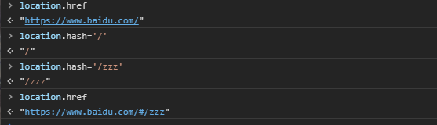
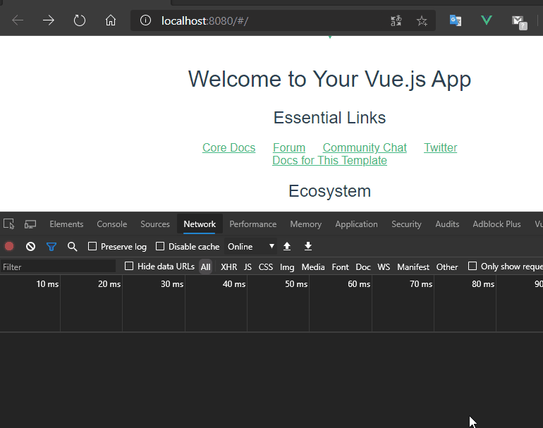
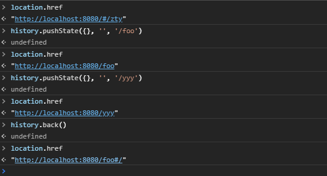
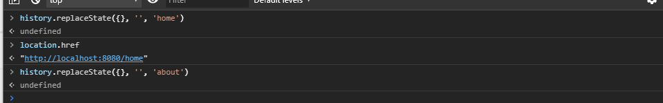
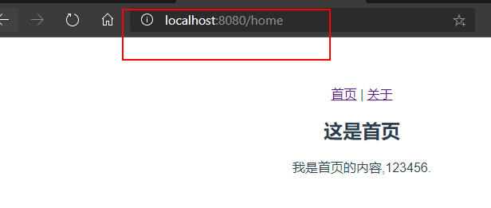
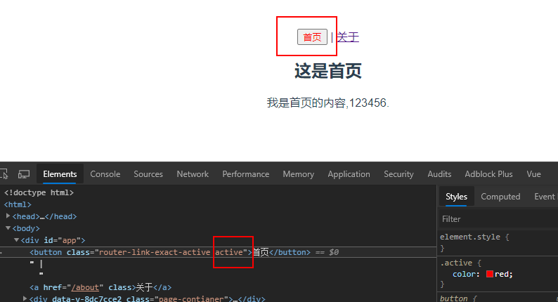
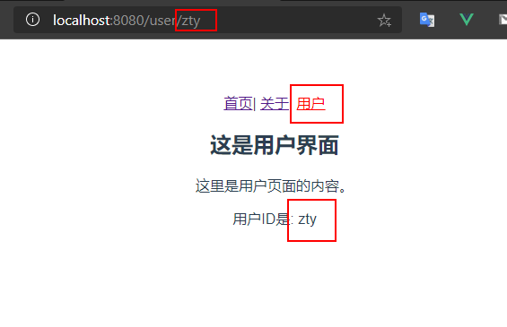
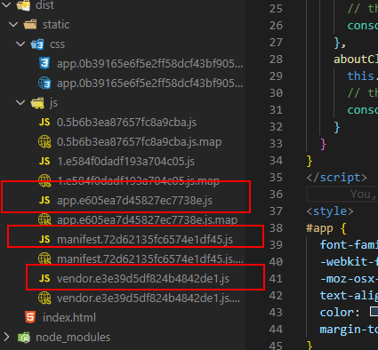
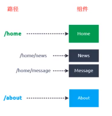
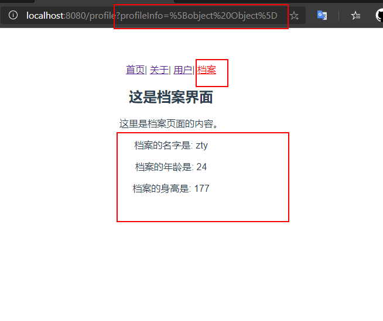

# （十七）vue-router

## 17.1	路由简介

**什么是路由？**

- 路由就是通过互联的网络把信息用源地址传送到目的地的活动

- 路由提供了两种机制：路由和传送
  - 路由是决定数据包从来源到目的地的路径
  - 转送就是将数据转移
- 路由表
  - 路由表本质就是一个映射表，决定了数据包的指向


## 17.2	前端/后端路由

1. 后端渲染（服务端渲染）
   jsp技术
   后端路由，后端处理URL和页面映射关系，例如springmvc中的@requestMapping注解配置的URL地址，映射前端页面
2. 前后端分离（ajax请求数据）
   后端只负责提供数据
   静态资源服务器（html+css+js）
   ajax发送网络请求后端服务器，服务器回传数据
   js代码渲染dom
3. 单页面富应用（SPA页面）
   前后端分离加上前端路由，前端路由的url映射表不会向服务器请求，是单独url的的页面自己的ajax请求后端，后端只提供api负责响应数据请求。改变url，页面不进行整体的刷新。
   整个网站只有一个html页面。

## 17.3	URL的hash和HTML5的history

### 17.3.1	URL的hash

- URL的hash是通过锚点(#)，其本质上改变的是window.location的href属性。
- 可以通过直接赋值location.hash来改变href，但是页面并不会发生刷新。



使用命令`vue init webpack 01-vue-router-vuecli2`创建新的vuecli2工程,等待创建完成后，使用`npm run dev`启动服务器，在浏览器通过http://localhost:8080进入工程主页。 测试通过改变hash，查看是否会刷新页面，浏览器的url地址是否改变。



> 结论

测试发现url的地址栏改变了变成了http://localhost:8080/#/zty，通过查看network发现只有favicon.ico资源重新请求了，这个是工程的logo图标，其他资源都未请求。可以通过改变hash改变url，此时页面是未刷新的。

vue-router其实用的就是这样的机制，改变url地址，这个url地址存在一份路由映射表里面，比如`/user`代表要请求用户页面，只要配置了这个路由表（路由关系），就可以前端跳转而不刷新页面，所有的数据请求都走ajax。

### 17.3.1	HTML5的history模式

> pushState

同样的使用HTML5的history模式也是不会刷新页面的,history对象栈结构，先进后出，pushState类似压入栈中，back是回退。

```js
hristory.pushState({}, '', '/foo')
history.back()
```



> replaceState

replaceState模式与pushState模式区别在于replaceState模式浏览器没有返回只是替换，不是压入栈中。

```js
history.replaceState({}, '', 'home')
```



> go

go只能在pushState模式中使用，go是前进后退到哪个历史页面。

```js
history.go(-1)//回退一个页面
history.go(1)//前进一个页面
history.forward()//等价于go(1)
history.back()//等价于go(-1)
```

## 17.4	vue-router的安装配置

1. 使用`npm install vue-router --save`来安装vue-router插件模块

2. 在模块化工程中使用他(因为是一个插件，所以可以通过Vue.user来安装路由功能)

   - 在src下创建一个router文件夹（一般安装vue-router时候会自动创建）用来存放vue-router的路由信息导入路由对象，并且调用**Vue.use(VueRouter)**
   - 创建路由实例，并且传入路由**映射配置**
   - 在vue实例中挂载创建的**路由实例对象**

   > router文件夹中的index.js

```js
/**
 * 配置路由相关信息
 * 1.先导入vue实例和vue-router实例
 */
import Vue from 'vue'
import Router from 'vue-router'
import HelloWorld from '@/components/HelloWorld'

// 2. 通过Vue.use(插件)，安装插件
Vue.use(Router)
//3. 创建 router路由对象
const routes = [
  //配置路由和组件之间的对应关系
  {
    path: '/',//url
    name: 'HelloWorld',
    component: HelloWorld //组件名
  }
]
const router = new Router({
  //配置路由和组件之间的应用关系
  routes
})
//4.导出router实例
export default router
```

> main.js中挂载router对象

```js
/* eslint-disable no-new */
new Vue({
  el: '#app',
  router,//使用路由对象，简写对象增强写法
  render: h => h(App)
})
```

## 17.4	vue-router的使用

### 17.4.1	创建路由组件

在components文件夹下创建2个组件。

> Home组件

```vue
<template>
  <div class="page-contianer">
    <h2>这是首页</h2>
    <p>我是首页的内容,123456.</p>
  </div>
</template>
<script type="text/ecmascript-6">
export default {
  name: 'Home'
}
</script>
<style scoped>
</style>
```

> About组件

```vue
<template>
  <div class="page-contianer">
    <h2>这是关于页面</h2>
    <p>我是关于页面的内容，about。</p>
  </div>
</template>
<script type="text/ecmascript-6">
export default {
  name: 'About'
}
</script>
<style scoped>
</style>
```

### 17.4.2	配置路由映射：组件和路径映射关系

在路由与组件对应关系配置在`routes`中。

> 修改index.js

```js
import Vue from 'vue'
import Router from 'vue-router'
import Home from '@/components/Home'

// 2. 通过Vue.use(插件)，安装插件
Vue.use(Router)
//3. 创建 router路由对象
const routes = [
  //配置路由和组件之间的对应关系
  {
    path: '/home',//home  前端路由地址
    name: 'Home',
    component: Home //组件名
  },
  {
    path: '/about',//about 前端路由地址
    name: 'About',
    component: () => import('@/components/About') //懒加载组件
  }
]
const router = new Router({
  //配置路由和组件之间的应用关系
  routes
})
//4.导出router实例
export default router
```


### 17.4.3	使用路由：通过`<router-link>`和`<router-view>` 

在app.vue中使用`<router-link>`和`<router-view>` 两个全局组件显示路由。

> `<router-link>`是全局组件，最终被渲染成a标签，但是`<router-link>`只是标记路由指向类似一个a标签或者按钮一样，但是我们点击a标签要跳转页面或者要显示页面，所以就要用上`<router-view>`。
>
> `<router-view>`  是用来占位的，就是路由对应的组件展示的地方，该标签会根据当前的路径，动态渲染出不同的组件。
>
> 路由切换的时候切换的是`<router-view>`挂载的组件，其他不会发生改变。
>
> `<router-view>`默认使用hash模式，可以在index.js中配置修改为history模式。

> app.vue修改template

```vue
<template>
  <div id="app">
    <router-link to="/home">首页</router-link> |
    <router-link to="/about">关于</router-link>
    <router-view/>
  </div>
</template>
```

使用`npm run dev`启动项目，此时`<router-view>`在`<router-link>`下面，那渲染页面就在下面，此时未配置路由的默认值，所以第一次进入网页的时候`<router-view>`占位的地方是没有内容的。


### 17.4.4	路由的默认值和history模式

> 路由的默认值，修改index.js的routes

```js
const routes = [
  {
    path: '',
    redirect: '/home'//缺省时候重定向到/home
  },
  //配置路由和组件之间的对应关系
  {
    path: '/home',//home  前端路由地址
    name: 'Home',
    component: Home //组件名
  },
  {
    path: '/about',//about 前端路由地址
    name: 'About',
    component: () => import('@/components/About') //懒加载组件
  }
]
```

添加缺省值，并重定向到`/home`路径，此时打开http://localhost:8080，直接显示home组件内容。

> 修改hash模式为history模式，修改index.js的router对象

```js
const router = new Router({
  //配置路由和组件之间的应用关系
  routes,
  mode: 'history'//修改模式为history
})
```

此时发现浏览器地址栏的URL是没有`#`的。



### 17.4.5	`<router-link>`的其他属性

1. `to`属性：用于跳转到指定路径。

2. `tag`属性：可以指定`<router-link>`之后渲染成什么组件使用`<router-link to='/home' tag='button'>`会被渲染成一个按钮，而不是a标签。

3. `relapce`属性：在history模式下指定`<router-link to='/home' tag='button' replace>`使用`replaceState`而不是pushState，此时浏览器的返回按钮是不能使用的。

4. `active-class`属性：当`<router-link>`对应的路由匹配成功的时候，会自动给当前元素设置一个`router-link-active`的class，设置active-class可以修改默认的名称。

   - 在进行高亮显示的导航菜单或者底部tabbar时，会用到该属性

   - 但是通常不会修改类的属性，会直接使用默认的`router-link-active`

   - `<router-link to='/home' tag='button' active-class='active'>`此时被选中的`<router-link>`就会有active的class。

   - 如果每个`<router-link>`都要加上`active-class='active'`，那就在路由里面统一更改。

     

   ```js
   const router = new Router({
     //配置路由和组件之间的应用关系
     routes,
     mode: 'history',//修改模式为history
     linkActiveClass: 'active'
   })
   ```

   

   ```vue
   <template>
     <div id="app">
       <router-link to="/home" tag='button' replace active-class='active'>首页</router-link> |
       <router-link to="/about" active-class='active'>关于</router-link>
       <router-view/>
     </div>
   </template>
   
   <script>
   export default {
     name: 'App'
   }
   </script>
   
   <style>
   #app {
     font-family: 'Avenir', Helvetica, Arial, sans-serif;
     -webkit-font-smoothing: antialiased;
     -moz-osx-font-smoothing: grayscale;
     text-align: center;
     color: #2c3e50;
     margin-top: 60px;
   }
   .active {
     color: red;
   }
   </style>
   ```

   修改app.vue文件此时被选中的`<router-link>`就有了active属性，给active的class加上字体变红的css。

   

### 17.4.6	通过代码修改路由跳转

> $router属性

```vue
<template>
  <div id="app">
    <!-- <router-link to="/home" tag='button' replace active-class='active'>首页</router-link> |
    <router-link to="/about" active-class='active'>关于</router-link> -->
    <button @click="homeClick">首页</button>|
    <button @click="aboutClick">关于</button>
    <router-view/>
  </div>
</template>

<script>
export default {
  name: 'App',
  methods: {
    homeClick() {//通过代码的路径修改路由
      this.$router.push('/home')//push 等价于pushState
      // this.$router.replace('/home')//replace 等价于replaceState
      console.log("homeClick")
    },
    aboutClick() {
      this.$router.push('/about')
      // this.$router.replace('/about')//replace 等价于replaceState
      console.log("aboutClick")
    }
  }
}
</script>

<style>
#app {
  font-family: 'Avenir', Helvetica, Arial, sans-serif;
  -webkit-font-smoothing: antialiased;
  -moz-osx-font-smoothing: grayscale;
  text-align: center;
  color: #2c3e50;
  margin-top: 60px;
}
.active {
  color: red;
}
</style>
```

修改app.vue，将`<router-link>`换成`button`等任何组件，添加上点击事件，并写好点击事件响应方法，此时使用`this.$router.push('/home')`，push方法 等价于pushState方法，replace 方法等价于replaceState方法。

## 17.5	渐入vue-router

### 17.5.1	vue-router的动态路由

一个页面的path路径可能是不确定的，例如可能有`/user/aaaa`或者`/user/bbbb`，除了`/user`之外，后面还跟上了用户ID`/user/123`等。这种path和component的匹配关系，叫动态路由。

> 新建一个User组件

```vue
<template>
  <div class="page-contianer">
    <h2>这是用户界面</h2>
    <p>这里是用户页面的内容。</p>
    <p>用户ID是: {{ userId }}</p>
  </div>
</template>
<script type="text/ecmascript-6">
export default {
  name: 'User',
  computed:{
    userId() {
      return this.$route.params.userId
    }
  }
}
</script>
<style scoped>
</style>

```

该组件定义一个计算属性，通过`this.$route.params.userId`获取处于激活状态的路由参数`userId`。

> 配置路由参数index.js

```js
  {
    path: '/user/:userId',
    name: 'User',
    component: () => import('@/components/User') //懒加载组件
  }
```

使用`:userId`指定动态路由参数`userId`。

> app.vue中添加user页面的`<router-link>`，并添加userId变量

```vue
    <router-link :to="/user/ + userId">用户</router-link>
```

```js
  data (){
    return {
      userId: 'zty'
    }
```

启动项目，点击用户。



> 总结

`$route`是代表处于激活状态的路由，这里指的也就是

```js
  {
    path: '/user/:userId',
    name: 'User',
    component: () => import('@/components/User') 
  }
```

通过`$route.params`获取[`$route`]([https://router.vuejs.org/zh/api/#%E8%B7%AF%E7%94%B1%E5%AF%B9%E8%B1%A1%E5%B1%9E%E6%80%A7](https://router.vuejs.org/zh/api/#路由对象属性))所有的参数，`$route.params.userId`，获取所有参数中的名字叫`userId`的属性，此时可以在User组件中动态获取路由参数，也就可以在app.vue中动态设置路由中的`userId`，其他属性请参考[`$route`]([https://router.vuejs.org/zh/api/#%E8%B7%AF%E7%94%B1%E5%AF%B9%E8%B1%A1%E5%B1%9E%E6%80%A7](https://router.vuejs.org/zh/api/#路由对象属性))。

### 17.5.2	vue-router的打包文件解析

> 问题：打包时候js太大，页面响应缓慢

如果组件模块化了，当路由被访问的时候才开始加载被选中的组件，这样就是懒加载，前面也介绍过。

```js
component: () => import('@/components/User') 
```

使用`npm run build`命令将之前创建的项目打包，打开dist文件夹，器目录结构如下：



- app.xxx.js是我们自己编写的业务代码
- vendor.xxx.js是第三方框架，例如vue/vue-router/axios等
- mainfest.xxx.js是为了打包的代码做底层支持的，一般是webpack帮我们做一些事情
- 除了这三个还多了2个js，这2个js文件（0.5bxxx.js和1.e5xxx.js）分别是About和User组件，因为这2个组件是懒加载的所以被分开打包了。


此时因为是懒加载，需要用到这个组件的时候才会加载，所以不会一次性请求所有js。

### 17.5.3	认识嵌套路由

平常在一个home页面中，我们可能需要`/home/news`和`/home/message`访问一些内容，一个路由映射一个组件就像后端一个api对应一个controller的一个requestMapping一样，访问两个路由也会分别渲染这两个组件。



要实现嵌套路由：

1. 创建对应的子组件，并且在路由映射(`router/index.js`)中配置对应的子路由。

2. 在组件内部使用`<router-view>`标签来占位。

   > 新建2个组件HomeNews和HomeMessage

```vue
<template>
  <div class="page-contianer">
    <ul>
      <li v-for="(item, index) in list">{{ item + index + 1 }}</li>
    </ul>
  </div>
</template>
<script type="text/ecmascript-6">
export default {
  name: 'HomeNews',
  data() {
    return {
      list: ['新闻', '新闻', '新闻', '新闻']
    }
  }
}
</script>
<style scoped></style>
```

```vue
<template>
  <div class="page-contianer">
    <ul>
      <li v-for="(item, index) in list">{{ item + index + 1 }}</li>
    </ul>
  </div>
</template>
<script type="text/ecmascript-6">
export default {
  name: 'HomeMessage',
  data() {
    return {
      list: ['消息', '消息', '消息', '消息']
    }
  }
}
</script>
<style scoped></style>
```

> 配置嵌套路由

```js
  {
    path: '/home',//home  前端路由地址
    name: 'Home',
    component: Home, //组件名
    children: [
      {
        path: '',
        redirect: '/home/news'//缺省时候重定向到/home/news
      },
      {
        path: 'news',//子嵌套路由 无须加/
        name: 'News',
        component: () => import('@/components/HomeNews') //懒加载组件
      },
      {
        path: 'message',
        name: 'Message',
        component: () => import('@/components/HomeMessage') //懒加载组件
      }
    ]
  },
```

> 修改Home.vue组件加上`<router-link>`和`<router-view/>`

```vue
<template>
  <div class="page-contianer">
    <h2>这是首页</h2>
    <p>我是首页的内容,123456.</p>
    <router-link to="/home/news">新闻</router-link>|
    <router-link to="/home/message">消息</router-link>
    <router-view/>
  </div>
</template>
```


### 17.5.4	vue-router的参数传递

之前的动态路由说的`userId`也是参数传递的方式的一种，准备新建一个Profile.vue组件，并配置路由映射，添加指定的`<router-link>`。

```vue
<template>
  <div class="page-contianer">
    <h2>这是档案界面</h2>
    <p>这里是档案页面的内容。</p>
    <p>档案的名字是: {{ profileInfo.name }}</p>
    <p>档案的年龄是: {{ profileInfo.age }}</p>
    <p>档案的身高是: {{ profileInfo.height }}</p>
  </div>
</template>
<script type="text/ecmascript-6">
export default {
  name: 'Profile',
  computed: {
    profileInfo() {
      return this.$route.query.profileInfo
    }
  }
}
</script>
<style scoped></style>
```

```js
  {
    path: '/profile',
    name: 'Profile',
    component: () => import('@/components/Profile')
  }
```

```vue
<router-link :to="{ path: '/profile', query: { profileInfo } }">档案</router-link>
```

在app.vue中设置初始的对象`profileInfo`

```js
  data (){
    return {
      userId: 'zty',
      profileInfo: {
        name: "zty",
        age: 24,
        height: 177
      }
    }
  }
```

传递参数主要有两种类型：params和query

> params的类型也就是动态路由形式

- 配置路由的格式：`/user/:userId`
- 传递的方式：在path后面跟上对应的userId
- 传递形成的路径：`/user/123`，`/user/xxx`
- 通过`$route.params.userId`获取指定userId

> query的类型

- 配置路由的格式：`/profile`，也就是普通的配置
- 传递的方式：对象中使用query的key作为传递的方式
- 传递形成的路径：`/profile?name=zty&age=24&height=177`（这个传递的是三个键值对），`/profile?profileInfo=%5Bobject%20Object%5D`（这个query传递的是一个对象的键值对，key为profileInfo，value是一个对象）



使用代码编写传递数据，使用`button`代替`<router-link>`，并添加点击事件。

```vue
    <button @click="userClick">用户</button>
    <button @click="profileClick">档案</button>
```

```js
    userClick() {
      this.$router.push('/user/' + this.userId)
      console.log("userClick")
    },
    profileClick() {
      let profileInfo = this.profileInfo
      this.$router.push({
        path: '/profile',
        query: {
          profileInfo
        }
      })
      console.log("profileClick")
    }
```

