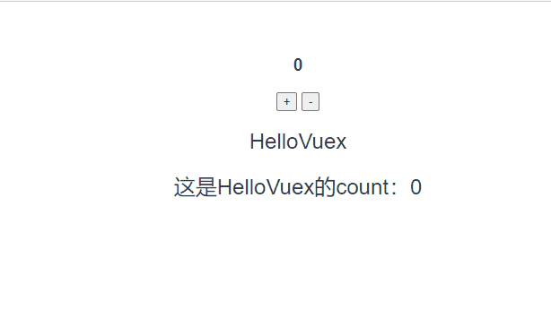
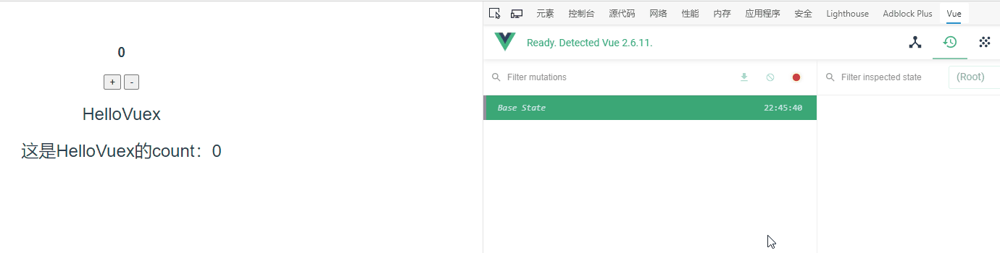
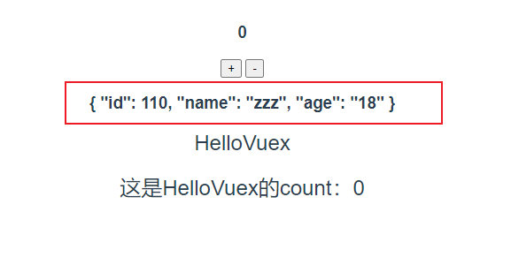
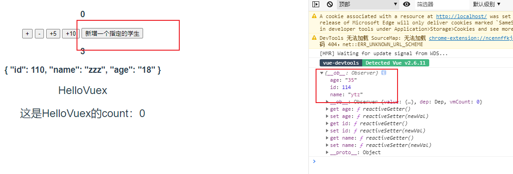
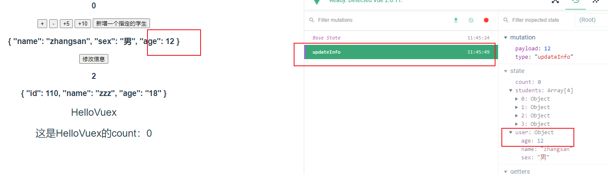
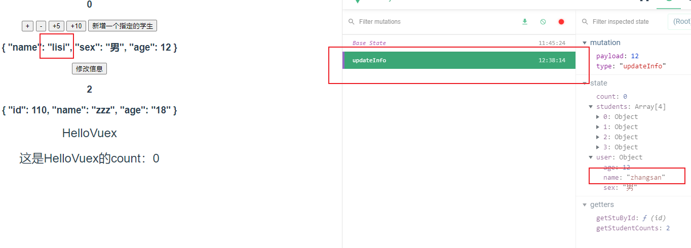
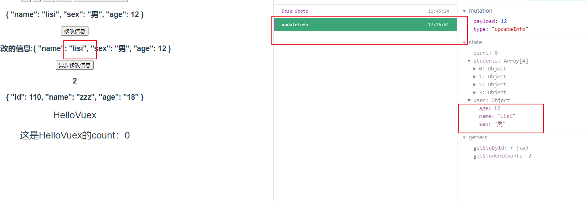
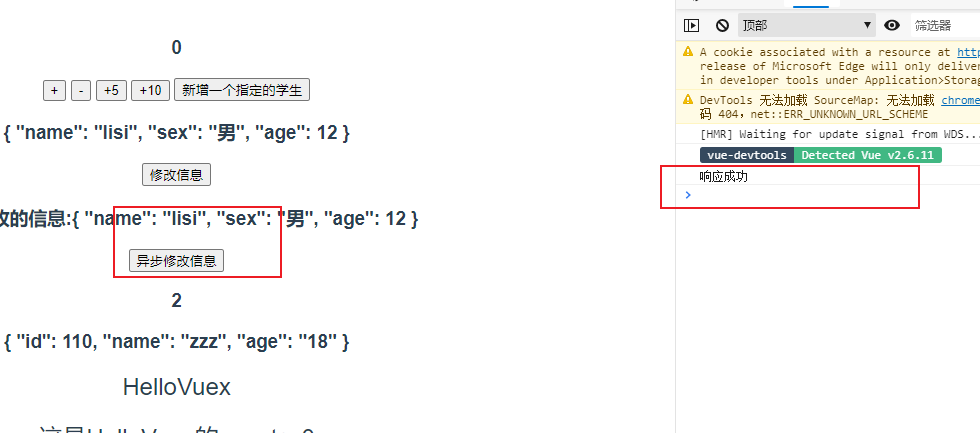

# （十九）Vuex

## 19.1	什么是Vuex

Vuex就是一个状态管理模式，为什么叫模式？因为Vuex包含了一套对state(状态)的操作规范，集中存储管理应用的所有组件的状态。

> 状态管理

- 简单来说就是管理各个组件共享的数据，类似session

- session可以存数据，存的过程就是管理，数据的每一次赋值就是当次状态。

- Vuex在Vue实例顶层中。

  Vuex也可以理解为java中的一个map，这个map是static（静态资源）的，每次获取map的值，都需要调用java的api，比如map.get(key)获取对应的值，也可以放入数据map.put(data)，而且这个数据是所有类都可以调用的，只需要导入这个map就能使用里面的共享数据。

  不了解java也没关系，你也可以理解成为百度百科就是一个容纳百科知识的容器，你要搜vuex，百科就会出现vuex的描述，这个搜索就是获取状态，如果你角色百科的vuex描述有误。你也可以发起修改操作，改成正确的vuex描述，这个修改操作就是修改vuex在百科里面的状态。当然你可以搜索修改vuex，别人也可以，因为这个状态是共享的。

  简单来看实现这个功能好像我们自己封装一个对象就能实现，但是Vuex有一个特性就是响应式。如果我们自己封装对象想做到完美响应式比较麻烦，所有Vuex帮我们做了这个事情。

> 什么状态需要Vuex去管理？

- 比如用户的登录的状态（token）、用户的信息（头像、名称、地理位置信息）等等
- 比如商品的收藏，购物车的商品等等
- 这些状态应该是响应式的，用户昵称、头像修改了需要响应

> Vuex简单模型


- **state**，驱动应用的数据源；
- **view**，以声明方式将 **state** 映射到视图；
- **actions**，响应在 **view** 上的用户输入导致的状态变化。

这是一个单页面数据流向，比如想要修改用户昵称，当前用户昵称的状态是A，通过输入框输入了新的昵称B，调用ajax请求后端修改成功后将state改成B，然后视图响应用户昵称的变化从A到B。

但是，当我们的应用遇到**多个组件共享状态**时，单向数据流的简洁性很容易被破坏：

- 多个视图依赖于同一状态。
- 来自不同视图的行为需要变更同一状态。
- 所以我们需要vuex的规范操作来管理状态。

## 19.2	Vuex基本使用

**1.新建一个vuecli2工程**

使用`vue init webpack 01-vuex-vuecli2`新建一个vue项目。

```shell
vue init webpack 01-vuex-vuecli2
```

**2.修改`App.vue`并新建一个`HelloVuex.vue`组件**

```vue
<template>
  <div id="app">
    <h3>{{ message }}</h3>
    <h3>{{ count }}</h3>
    <button @click="count++">+</button>
    <button @click="count--">-</button>
    <hello-vuex :count="count"/>
  </div>
</template>

<script>
import HelloVuex from './components/HelloVuex'

export default {
  name: 'App',
  data () {
    return {
      message: '',
      count: 0
    }
  },
  components: {
    HelloVuex
  }
}
</script>
```

> HelloVuex.vue

```vue
<template>
  <div class="hello">
    <h2>{{ message }}</h2>
    <h2>{{ count }}</h2>
  </div>
</template>

<script>
export default {
  name: 'HelloVuex',
  data () {
    return {
      message: 'HelloVuex'
    }
  },
  props: {
    count: Number
  }
}
</script>
```

此时我们使用了父子组件通信来完成子组件`HelloVuex`获取父组件的`count`。



如果不是父子组件如何通信，此时就需要vuex了，还是这这2个组件，现在不使用父子通信，直接使用vuex。

**3.使用vuex管理状态**

- 使用`npm install vuex --save`安装Vuex

- 安装插件Vue.use(Vuex)`，在src下新建一个store文件夹，新建一个index.js

  ```js
  import Vue from 'vue'
  import Vuex from 'vuex'
  
  // 1.安装插件
  Vue.use(Vuex)
  
  // 2.创建对象
  const store = new Vuex.Store({
    state: { // 状态集合
      count: 0 // 具体的状态数据
    }
  })
  
  // 3.导出store对象
  export default store
  ```

- 修改`App.vue`和`HelloVuex.vue`，直接使用`$store.state.count`获取count值

  ```vue
  <template>
    <div id="app">
      <h3>{{ message }}</h3>
      <h3>{{ $store.state.count }}</h3>
      <button @click="$store.state.count++">+</button>
      <button @click="$store.state.count--">-</button>
      <hello-vuex />
    </div>
  </template>
  
  <script>
  import HelloVuex from './components/HelloVuex'
  
  export default {
    name: 'App',
    data () {
      return {
        message: ''
      }
    },
    components: {
      HelloVuex
    }
  }
  </script>
  ```

  ```vue
  <template>
    <div class="hello">
      <h2>{{ message }}</h2>
      <h2>这是HelloVuex的count：{{ $store.state.count }}</h2>
    </div>
  </template>
  
  <script>
  export default {
    name: 'HelloVuex',
    data () {
      return {
        message: 'HelloVuex'
      }
    }
  }
  </script>
  ```

一般不会直接使用`$store.state.count`获取vuex中的状态，也不是直接使用`$store.state.count++`来操作vuex中的状态。

## 19.3	Vuex的流程


- Vue Components是vue组件
- Mutations ：更改 Vuex 的 store 中的状态的唯一方法是提交 mutation
- State 是vuex中状态的集合
- Actions与Mutations 类似，经常与后端交互，不同在于：
  - Action 提交的是 mutation，而不是直接变更状态。
  - Action 可以包含任意异步操作。

组件中修改state，通过提交 mutation，修改完成后vuex帮我们响应到vue组件上。

> 修改index.js使用mutation

```js
// 2.创建对象
const store = new Vuex.Store({
  state: { // 状态集合
    count: 0 // 具体的状态数据
  },
  mutations: { // 操作修改state（状态）
    increment (state) { // 增加
      state.count++
    },
    decrement (state) { // 减少
      state.count--
    }
  }
})
```

> 修改App.vue提交mutation

```vue
<template>
  <div id="app">
    <h3>{{ message }}</h3>
    <h3>{{ $store.state.count }}</h3>
    <button @click="add">+</button>
    <button @click="sub">-</button>
    <hello-vuex />
  </div>
</template>

<script>
import HelloVuex from './components/HelloVuex'

export default {
  name: 'App',
  data () {
    return {
      message: ''
    }
  },
  components: {
    HelloVuex
  },
  methods: {
    add () {
      this.$store.commit('increment')
    },
    sub () {
      this.$store.commit('decrement')
    }
  }
}
</script>
```

> 测试



测试发现没有问题与直接使用`$store.state.count++`效果一致，通过提交mutation修改了状态state，在`vue-devtools`中也能跟踪state变化以及提交的mutation。

## 19.4	Vuex的核心概念

- State
- Getters
- Mutation
- Action
- Moudule


### 19.4.1	State（单一状态树）

Vuex 使用**单一状态树**——是的，用一个对象就包含了全部的应用层级状态。至此它便作为一个“唯一数据源 ([SSOT](https://en.wikipedia.org/wiki/Single_source_of_truth))”而存在。。这也意味着，每个应用将仅仅包含一个 store 实例。单一状态树让我们能够直接地定位任一特定的状态片段，在调试的过程中也能轻易地取得整个当前应用状态的快照。

简单说就是把数据所有有关的数据封装到一个对象中，这个对象就是store实例，无论是数据的状态（state），以及对数据的操作（mutation、action）等都在store实例中，便于管理维护操作。

state的操作在19.2.Vuex的基本使用已经了解，直接通过`this.$store.state`获取state对象。

### 19.4.2	Getters

Getters类似计算属性，帮我们做一些重复的事情。

例如有这样一个store实例，我们需要获取**年龄大于20岁的学生数量**：

```js
const store = new Vuex.Store({
  state: { // 状态集合
    students: [
      {id: 110, name: 'zzz', age: '18'},
      {id: 111, name: 'ttt', age: '20'},
      {id: 112, name: 'yyy', age: '22'},
      {id: 113, name: 'zty', age: '25'}
    ]
  }
})
```

你可能会这样写这样一个计算属性去获取**年龄大于20岁的学生数量**：

```js
computed: {
    stuCount() {
      return this.$store.state.students.filter(student => student.age > 20).length
    }
  }
```

如果很多组件中需要**年龄大于20岁的学生数量**，你可能会将这个计算属性复制，将filter函数写很多遍，但是如果你有**Getters**。

> 在store实例中定义getters

```js
  getters: {
    getStudentCounts: state => {
      return state.students.filter(s => s.age > 20).length
    }
  }
```

> 通过属性调用getters

```
computed: {
    stuCount() {
      return this.$store.getters.getStudents
    }
  }
```

现在只需要调用getters的getStudents对象，就能获取数量。

如果你想查询指定ID（传入ID）的学生信息。

你也可以通过让 getter 返回一个函数，来实现给 getter 传参。在你对 store 里的数组进行查询时非常有用。

> 定义getters

```js
  getters: {
    getStuById: state => id => {
      return state.students.find(s => s.id === id)
    }
  }
```

> 通过方法访问

```js
  computed: {
    stuById() {
      return this.$store.getters.getStuById(110)
    }
  }
```

传入学生ID为110，输出



### 19.4.5	Mutation（状态更新）

- Vuex的store状态更新的唯一方式：**提交Mutation**

- Mutation主要包括两个部分：

  1. 字符串的**事件类型（type）**
  2. 一个**回调函数（handler）**，这个回调函数就是我们实际进行状态更改的地方，该回调函数的**第一个参数就是state**

- Mutation的定义方式：

  ```js
  mutation: {
      increment (state) {
          state.count++
      }
  }
  ```

- 通过Mutation更新

  ```js
  mutation () {
  	this.$store.commit('increment')
  }
  ```


#### 19.4.5.1	mutation接受单个参数

mutation携带的参数被称为是mutation的载荷（Payload）

在19.2的工程的基础上修改，添加2个按钮分别是让state中的**count+5、count+10**，增加2个按钮

```vue
<button @click="addCount(5)">+5</button>
<button @click="addCount(10)">+10</button>
```

新增**addCount**方法:

```js
addCount (count) {
    this.$store.commit('addCount', count) // 将count传入
}
```

新增一个mutation

```js
addCount (state, count) { // 第二个参数是count，第一个始终是state
	state.count+=count
}
```

测试：


#### 19.4.5.2	mutation接受多个参数

如果mutation需要接受多个参数，此时可以传一个对象，例如新增一个功能点击按钮新增一个学生，此时需要传学生的ID、姓名、年龄，可以封装成一个学生对象传入。

1. **新增按钮**

   ```vue
   <button @click="addStu()">新增一个指定的学生</button>
   ```

2. **新增mutation**

   ```js
   addStu (state, stu) {
       state.students.push(stu) // 向数组中添加指定的stu
       console.log(state.students.find(s => s.id === stu.id)) // 输出打印查看state中是否有新增stu
   }
   ```

3. **新增方法**

   ```js
   addStu () {
       const stu = {
           id: 114,
           name: 'ytz',
           age: '35'
       }
       this.$store.commit('addStu', stu)
   }
   ```

4. **测试**

   


#### 19.4.5.3	mutation的提交风格

1. 普通提交风格

   ```js
   this.$store.commot('increment', count)
   ```

   此时count传过去的就是count=10

2. 特殊的提交封装

   ```js
   this.$store.commit({
   	type: 'addCount',
   	count
   })
   ```

   ```js
   addCount (state, payload) { // 此时传入的就不是一个count值了，而是一个对象
   	state.count += payload.count
   }
   ```

   此时count传过去是一个对象payload（载荷）

   ```js
   {
   	type: 'incrementCount',
   	count: 10
   }
   ```

#### 19.4.5.4	Vuex的响应式原理

1. Vuex的store的state是响应式的，当state中的数据发生改变时，Vue组件会自动更新。
2. 响应式需要遵循规则
   - state的对象需要初始化
   - 如果需要给state中的对象添加新属性的时候，使用以下方式
     1. 使用Vue.set(obj, 'newProp', 123)
     2. 用新对象替换就对象


1. 在state中增加一个对象user

   ```js
   user: {
       name: 'zhangsan',
       sex: '男'
   }
   ```

2. 在app.vue增加按钮修改信息

   ```vue
   <h3>{{ $store.state.user }}</h3>
   <button @click="updateInfo()">修改信息</button>
   ```

3. app.vue增加按updateInfo()方法

   ```js
   updateInfo () {
       this.$store.commit('updateInfo', 12)
   }
   ```

4. 在mutation中添加updateInfo()

   ```json
   updateInfo (state, age) {
       state.user.age = age
   }
   ```

   

5. 点击**修改信息**按钮，发现state的值变化了，但是页面没有响应变化

   

6. 使用`Vue.set()`方法支持响应式

   ```js
       updateInfo (state, age) {
         // state.user.age = age
         Vue.set(state.user, 'age', 12)
       }
   ```

   

7. 再次点击**修改信息**按钮，发现变响应式了

   

> 总结

1. state未初始化属性（`age`）

   - 使用直接赋值的方式不能响应式
   - 需要使用` Vue.set(state.user, 'age', 12)`

2. state已经初始化了，可以使用直接赋值方式

3. 关于删除属性

   ```js
         // 该方法没有响应式，需要使用vue.delete
         // delete state.user.age
         Vue.delete(state.user, age)// 响应式删除age
   ```


#### 19.4.5.5	mutation的类型常量

一个vue文件中有关mutation的方法太多了，常常可能写错，所有可以在store文件夹下定义一个`mutation-type.js`的常量。

1. 定义一个`mutation-type.js`的常量

```json
export const UPDATEINFO = 'updateInfo'
```
2. 修改`App.vue`的updateinfo方法

```js
import { UPDATEINFO } from './store/mutation-type'
[UPDATEINFO] () {
	this.$store.commit(UPDATEINFO, 12)
}
```

3. 修改store的`index.js`，将mutation的方法名也改成常量使用方式

```js
import { UPDATEINFO } from './mutation-type'
[UPDATEINFO] (state, age) {
    // state.user.age = age
    Vue.set(state.user, 'age', 12)
    // 该方法没有响应式，需要使用vue.delete
    // delete state.user.age
    // Vue.delete(state.user, age)// 响应式删除age
}
```

这样保证了所有的方法都定义在`mutation-type.js`中，不会出问题。


### 19.4.6	Actions


使用mutation操作更新state的时候，使用异步修改数据。

1. 修改updateInfo()方法

```js
[UPDATEINFO] (state, age) {
    Vue.set(state.user, 'age', 12)
    setTimeout(() => { // 延时模拟异步网络请求
        state.user.name = 'lisi'
    }, 1000)
}
```

2. 点击**修改信息**按钮



发现页面的数据改变了，但是vue-devtools工具中并未跟踪到改变。所以我们不要在mutation中进行异步操作。

> 定义

Action 类似于 mutation，不同在于：

- Action 提交的是 mutation，而不是直接变更状态。
- Action 可以包含任意异步操作。

1. 新增一个mutation

```js
updateName (state, name) {
	state.user.name = name
}
```

2. 新增一个actions

```js
actions: {
    // context：上下文
    aUpdateInfo (context, name) {
        setTimeout(() => {
        context.commit(UPDATEINFO, 12)
        }, 1000)
    }
}
```

3. 在`App.vue`中新增一个按钮修改user对象姓名

```vue
<h3>异步修改的信息:{{ $store.state.user }}</h3>
<button @click="aUpdateInfo()">异步修改信息</button>
```

4. 给按钮新增方法

```js
aUpdateInfo () {
	this.$store.dispatch('aUpdateInfo', 'lisi')
}
```

5. 点击`异步修改信息`按钮测试



在点击按钮之后，信息修改了，dev-tools也能跟踪到state的变化。通过`$store.dispacth()`方法来调用actions，发送异步请求，在actions中需要提交mutation来修改state。

6. actions回调，在异步操作后，成功或者失败都应该会有回调，`$store.dispacth()`返回一个Promise对象，修改actions，返回一个Promise对象，成功调用`resolve(msg)`，将成功的`msg`传入（**不理解的请看一下18章的Promise对象详解**）。

   ```js
   actions: {
       // context：上下文
       aUpdateInfo (context, name) {
           let msg = '响应成功'
           return new Promise((resolve, reject) => {
               setTimeout(() => {
                   context.commit(UPDATEINFO, 12)
                   resolve(msg)
               }, 1000)
           })
       }
   }
   ```

   

7. 修改`aUpdateInfo()`方法，获取回调参数`msg`，此时的`response`就是actions中回调的`msg`，也可以支持失败的回调，只要actions中使用了reject，在`aUpdateInfo()`方法中catch回调结果就能获取resjct对象回传结果。

   ```js
   aUpdateInfo () {
       this.$store.dispatch('aUpdateInfo', 'lisi').then(response => {
           console.log(response)
       })
   }
   ```

8. 再次点击`异步修改信息`，打印结果信息

   

> Actions 支持同样的载荷方式(**payload**)和对象方式进行分发

```js
// 以载荷形式分发
store.dispatch('aUpdateInfo', {
  name: 'lisi'
})

// 以对象形式分发
store.dispatch({
  type: 'aUpdateInfo',
  name: 'lisi'
})
```


### 19.4.7	moudules（模块）

由于使用单一状态树，应用的所有状态会集中到一个比较大的对象。当应用变得非常复杂时，store 对象就有可能变得相当臃肿。

为了解决以上问题，Vuex 允许我们将 store 分割成**模块（module）**。每个模块拥有自己的 state、mutation、action、getter、甚至是嵌套子模块——从上至下进行同样方式的分割。

比如这样

```js
const moduleA = {
  state: () => ({ ... }),
  mutations: { ... },
  actions: { ... },
  getters: { ... }
}

const moduleB = {
  state: () => ({ ... }),
  mutations: { ... },
  actions: { ... }
}

const store = new Vuex.Store({
  modules: {
    a: moduleA,
    b: moduleB
  }
})

store.state.a // -> moduleA 的状态
store.state.b // -> moduleB 的状
```


> 模块的局部状态

1. 模块内部的mutation 和 getter，接收的第一个参数是**模块的局部状态对象**。

2. 模块内部的 action，局部状态是 `context.state` ，根节点状态则为 `context.rootState`。

3. 对于模块内部的 getter，第三个参数是根节点状态。

   ```js
   const moduleA = {
     state: () => ({
       count: 0
     }),
     mutations: {
       increment (state) {
         // 这里的 `state` 对象是模块的局部状态
         state.count++
       }
     },
     actions: {
       incrementIfOddOnRootSum (context) {
         if ((context.state.count + context.rootState.count) % 2 === 1) {
           context.commit('increment')
         }
       }
     },
     getters: {
       doubleCount (state, getters, rootState) {
         console.log(rootState.count) // 获取的是根状态的count
         return state.count * 2
       }
     }
   }
   ```

   > 注意actions的context

   ```js
   actions: {
       incrementIfOddOnRootSum ({ state, commit, rootState }) {
           if ((context.state.count + context.rootState.count) % 2 === 1) {
               context.commit('increment')
           }
       }
   }
   ```

   `{ state, commit, rootState }`对应`context`对象中的属性，使用ES6的对象解构。


### 19.4.8 	项目结构

Vuex 并不限制你的代码结构。但是，它规定了一些需要遵守的规则：

1. 应用层级的状态应该集中到单个 store 对象中。
2. 提交 **mutation** 是更改状态的唯一方法，并且这个过程是同步的。
3. 异步逻辑都应该封装到 **action** 里面。

只要你遵守以上规则，如何组织代码随你便。如果你的 store 文件太大，只需将 action、mutation 和 getter 分割到单独的文件。

对于大型应用，我们会希望把 Vuex 相关代码分割到模块中。下面是项目结构示例：

```bash
├── index.html
├── main.js
├── api
│   └── ... # 抽取出API请求
├── components
│   ├── App.vue
│   └── ...
└── store
    ├── index.js          # 我们组装模块并导出 store 的地方
    ├── actions.js        # 根级别的 action
    ├── mutations.js      # 根级别的 mutation
    └── modules
        ├── cart.js       # 购物车模块
        └── products.js   # 产品模块
```